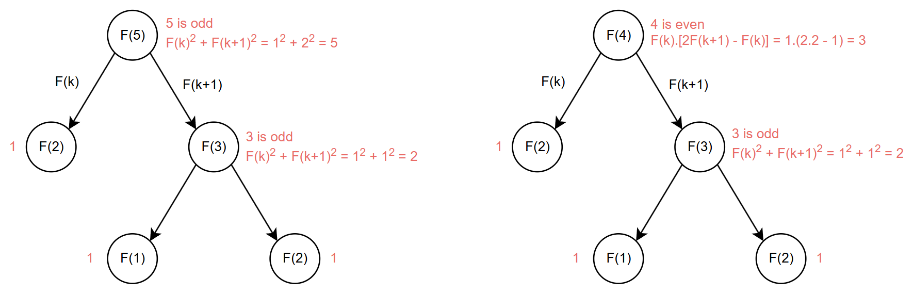

# GIẢI THUẬT PARALLEL FIBONANCI

**Ý tưởng chính**: để tính số Fibonanci thứ n song song, thay vì sử dụng công thức $F(n) = F(n-1) + F(n-2)$, ta phân tách n thành hai số $a$ và $b$ rồi sử dụng công thức $F(a + b) = F(a)F(b-1) + F(a+1)F(b)$. Tiếp tục biến đổi với trường hợp $a=b=k$, ta thu được công thức:

$$
\begin{aligned}
    F(2k) = F(k)(2F(k+1) - F(k)) \\
    F(2k + 1) = F(k + 1)^2 + F(k)^2
\end{aligned}
$$

Vậy ta chỉ cần phân phối đệ quy tính toán $F(k)$ và $F(k+1)$ với $k = \frac{n}{2}$ trên các processor khác nhau và dựa vào tính chẵn lẻ của n để tổng hợp kết quả theo công thức trên.

**Mã giả**:
```actionscript
function Fibonanci(n):
    if (n < 0):
        return null
    if (n == 0):
        return 0
    if (n <= 2):
        return 1

    k = n / 2
    Fi_k = fork Fibonanci(k)
    Fi_k1 = fork Fibonanci(k + 1)

    join Fi_k and Fi_k1

    if (n % 2 == 0):
        return Fi_k * (2 * Fi_k1 - Fi_k)
    else:
        Fi_k1**2 + Fi_k**2
```

**Giải thích**: hàm `Fibonanci(n)` có chức năng tính toán số Fibonanci thứ n. Ta xét các bài toán cơ sở:

* Với $n < 0$: trả về kết quả $null$ (Ta chỉ quan tâm đến các số nguyên dương).
* Với $n = 0$ hoặc $n \leq 2$: trả về kết quả 0 hoặc 1 tương ứng với 3 giá trị đầu tiên của dãy Fibonanci (0 1 1...).

Ta xét giá trị `k = n / 2` và gọi đệ quy để tính toán `Fibonanci(k)` và `Fibonanci(k + 1)` một cách song song. Kết quả tổng hợp sẽ được trả về dựa theo công thức trên và tính chẵn lẻ của $n$ khi hai tác vụ hoàn thành.
**Độ phức tạp**:
$$
Work: O(n) \\
Depth: O(logn) \\
$$

**Ví dụ minh hoạ**:
