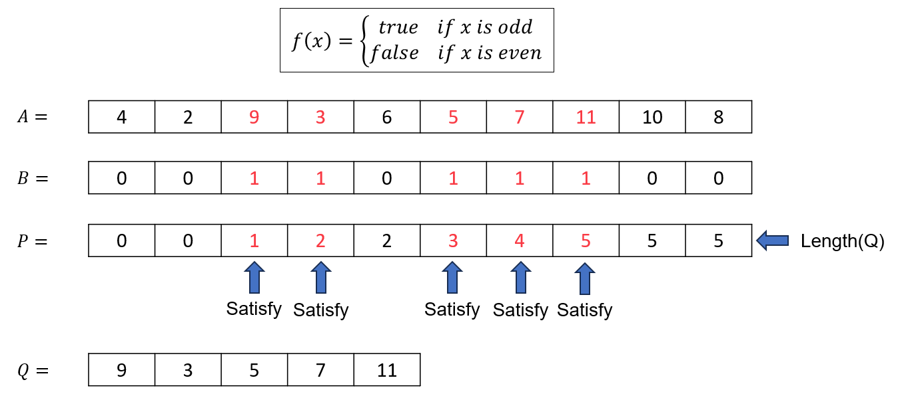

# GIẢI THUẬT PARALLEL FILTERING/PACKING

**Ý tưởng chính**: để lọc ra các phần tử trong mảng $A$ thoã mãn hàm điều kiện $F$ cho trước một cách song song, trước tiên, ta tiến hành áp dụng song song hàm $F$ lên từng phần tử của mảng để thu được mảng $B$ bao gồm hai giá trị 1 (thoã mãn điều kiện) và 0 (không thoã mãn điều kiện). Tiếp theo, để truy xuất các phần tử thoã mãn điều kiện, ta tính toán song song mảng tổng tiền tố $P$ bằng cách thực hiện giải thuật Parallel Prefix-Sum với mảng $B$. Dễ dàng thấy được số lượng giá trị thoã mãn là phần tử cuối của $P$ và chúng nằm ở các vị trí $i$ sao cho $P[i] \ne P[i-1]$.

**Mã giả**:
```actionscript
function Filtering(A, F):
    in parallel: 
        for i = 1 to length(A): B[i] = F(A[i])
    
    P = parallelPrefixSum(B)
    Q = initArr(0, P.last)
    
    in parallel:
        for i = 1 to length(P):
            if (P[i] != P[i-1])
                Q[P[i]] = A[i]

    return Q
```

**Giải thích**: hàm `Filtering(A, F)` có chức năng lọc các phần tử thoã mãn hàm điều kiện $F$. Đầu tiên ta khởi tạo mảng $B$ bằng cách áp dụng song song hàm $F$ lên từng phần tử của mảng $A$. Sau đó, thuật toán `parallelPrefixSum(B)` được áp dụng nhằm tính toán tổng tiền tố của mảng $B$ một cách song song, theo sau là hàm `initArr(0, P.last)` để khởi tạo mảng $Q$ với các giá trị 0 và có độ dài bằng với phần tử cuối của mảng $P$ (Hay số lượng các giá trị thoã mãn). Cuối cùng, mảng $Q$ được cập nhật giá trị bằng cách duyệt song song các vị trí $i$ trong mảng $P$ và thực hiện `Q[P[i]] = A[i]` với $P[i] \ne P[i-1]$ 

**Độ phức tạp**:

$$
\begin{aligned}
    Work&: O(n) \\
    Depth&: O(logn)
\end{aligned}
$$

**Ví dụ minh hoạ**:
