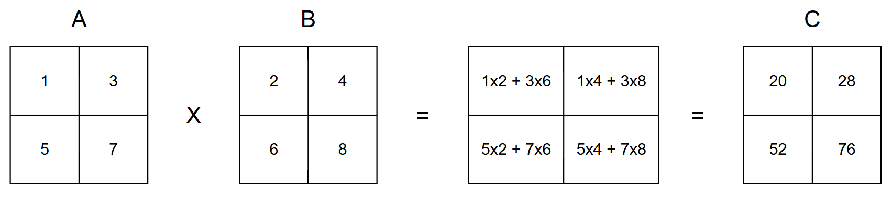

# GIẢI THUẬT PARALLEL MATRIX MULTIPLICATION

**Ý tưởng chính**: để nhân hai ma trận vuông $A$ và $B$ có kích thước $2^n$ một cách song song, ta chia các ma trận thành 4 phần bằng nhau và phân phối đệ quy thực hiện phép nhân ma trận trên các processor khác nhau. Ma trận kết quả $C$ được tổng hợp dựa trên công thức:

$$
\begin{aligned}
    &C_{11} = X_{11}Y_{11} + X_{12}Y_{21} \\
    &C_{12} = X_{11}Y_{12} + X_{12}Y_{22} \\
    &C_{21} = X_{21}Y_{11} + X_{22}Y_{21} \\
    &C_{22} = X_{21}Y_{12} + X_{22}Y_{21}
\end{aligned}
$$

**Mã giả**:
```actionscript
function matrixMultiply(A, B):
    n = length(A)
    
    if n == 1:
        return [[A[0][0] * B[0][0]]]
    
    A11 = submatrix(A, 0, 0, n/2, n/2)
    A12 = submatrix(A, 0, n/2, n/2, n)
    A21 = submatrix(A, n/2, 0, n, n/2) 
    A22 = submatrix(A, n/2, n/2, n, n)
    
    B11 = submatrix(B, 0, 0, n/2, n/2)
    B12 = submatrix(B, 0, n/2, n/2, n)
    B21 = submatrix(B, n/2, 0, n, n/2)
    B22 = submatrix(B, n/2, n/2, n, n)
    
    C11 = fork matrixAdd(fork matrixMultiply(A11, B11), fork matrixMultiply(A12, B21))
    C12 = fork matrixAdd(fork matrixMultiply(A11, B12), fork matrixMultiply(A12, B22))
    C21 = fork matrixAdd(fork matrixMultiply(A21, B11), fork matrixMultiply(A22, B21))
    C22 = fork matrixAdd(fork matrixMultiply(A21, B12), fork matrixMultiply(A22, B22))

    join all tasks

    C = []
    for row in range(n):
        if row < n/2:
            C.append(concatenate(C11[row], C12[row]))
        else:
            C.append(concatenate(C21[row-n/2], C22[row-n/2]))
    
    return C
```

**Giải thích**: hàm `matrixMultiply(A, B)` có chức năng nhân hai ma trận $A$ và $B$ kích thước $2^n$. Với bài toán cơ sở là ma trận kích thước 1, ta thực hiện phép nhân trực tiếp và trả về kết quả. Tiến hành chia ma trận $A$ và $B$ thành 4 ma trận con thông qua hàm `submatrix`: $A11, A12, A21, A22$ và $B11, B12, B21, B22$. Sau đó thực hiện các hàm nhân đệ quy `matrixMultiply` và cộng `matrixAdd` trên các ma trận này một cách song song. Ma trận kết quả $C$ sẽ được ghép nối tổng hợp dựa theo công thức trên khi toàn bộ các tác vụ song song hoàn thành.

**Độ phức tạp**:
$$
Work: O(n^3) \\
Depth: O(log^2n) \\
$$

**Ví dụ minh hoạ**:
