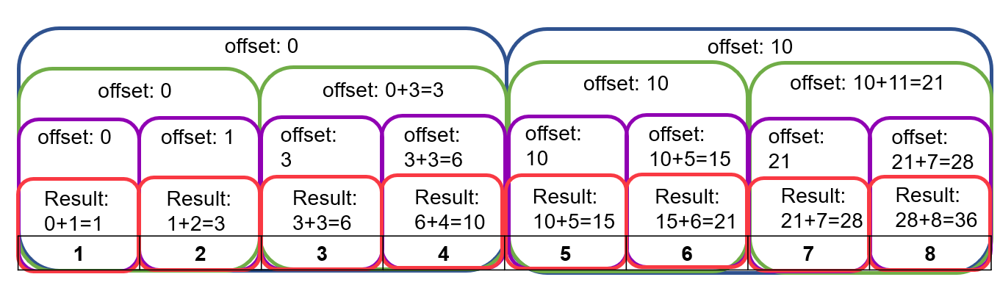

# GIẢI THUẬT PARALLEL PREFIX-SUM

**Ý tưởng chính**: để tính tổng tiền tố trong đoạn $[L, R]$ một cách song song, ta chia đoạn thành hai phần cây bên trái và cây bên phải nhằm phân phối xử lý đệ quy trên các processor khác nhau. Để tổng hợp kết quả, ta cần duy trì tổng tích luỹ ($offset$) của cây con bên trái và cập nhật giá trị cho cây con bên phải dựa trên giá trị này. Nhằm hiện thực việc tính toán cho $offset$, ta thực hiện trước bài toán tính tổng trên từng phân đoạn và lưu lại kết quả.

**Mã giả**:
```actionscript
function preSum(A, L, R, preSumDict):
    if not (1 <= L <= R <= lenght(A)):
        return null
    
    if (L == R):
        preSumDict[(L, L)] = A[L]
        return A[L]
    
    mid = (L + R) / 2
    leftSum = fork Sum(A, L, mid, preSumDict)
    rightSum = fork Sum(A, mid + 1, R, preSumDict)

    join leftSum and rightSum

    sumLR = leftSum + rightSum
    preSumDict[(L, R)] = sumLR
    return sumLR


function prefixSum(A, L, R, offset, preSumDict):
    if not (1 <= L <= R <= lenght(A)):
        return
    
    if (L == R):
        prefixSumArray[L] = A[L] + offset
        return
    
    mid = (L + R) / 2
    leftSum = preSumDict[(L, mid)]

    leftPrefixSum = fork prefixSum(A, L, mid, offset, preSumDict)
    rightPrefixSum = fork prefixSum(A, mid + 1, R, offset + leftSum, preSumDict)

    join leftPrefixSum and rightPrefixSum
```

**Giải thích**:
* **`preSum(A, L, R, preSumDict)`**: hàm có chức năng tính tổng các phần tử của mảng $A$ trong đoạn từ $[L, R]$ và lưu kết quả vào từ điển $preSumDict$. Ta kiểm tra điều kiện của $L$ và $R$ ($1 \leq L \leq R \leq |A|$), hàm sẽ lưu lại tổng của mảng trong đoạn $[L, L]$, đồng thời trả về giá trị của phần tử tại chỉ số $L$ nếu thoã mãn $L = R$ và $null$ trong trường hợp còn lại. Tiến hành chia đôi khoảng từ $L$ đến $R$ bằng chỉ số `mid = (L + R) / 2`, sau đó gọi đệ quy `leftSum = Sum(A, L, mid, preSumDict)` và `rightSum = Sum(A, mid + 1, R, preSumDict)` để xử lý hai đoạn con một cách song song. Kết quả tổng hợp sẽ được trả về khi hai tác vụ trên hoàn thành với `sumLR = leftSum + rightSum` và cập nhật từ điển với `preSumDict[(L, R)] = sumLR`.
* **`prefixSum(A, L, R, offset, preSumDict)`**: hàm có chức năng tính tổng tiền tố các phần tử của mảng $A$ trong đoạn từ $[L, R]$ với việc bổ sung $offset$ vào từng phần tử. Ta kiểm tra điều kiện của $L$ và $R$ ($1 \leq L \leq R \leq |A|$), hàm sẽ cập nhật giá trị mảng $prefixSumArray$ với `prefixSumArray[L] = A[L] + offset` nếu thoã mãn $L = R$ và thoát khỏi hàm trong các trường hợp còn lại. Tiến hành chia đôi khoảng từ $L$ đến $R$ bằng chỉ số `mid = (L + R) / 2`, sau đó gọi đệ quy $prefixSum$ cho nửa trái với $offset$ (`prefixSum(A, L, mid, offset, preSumDict)`) và cho nửa phải với $offset + leftSum$ (`prefixSum(A, mid + 1, R, offset + leftSum, preSumDict)`) một cách song song, trong đó $leftSum$ là tổng các phần tử từ $L$ đến $mid$ đã được tính trước đó.

**Ví dụ minh hoạ**:
