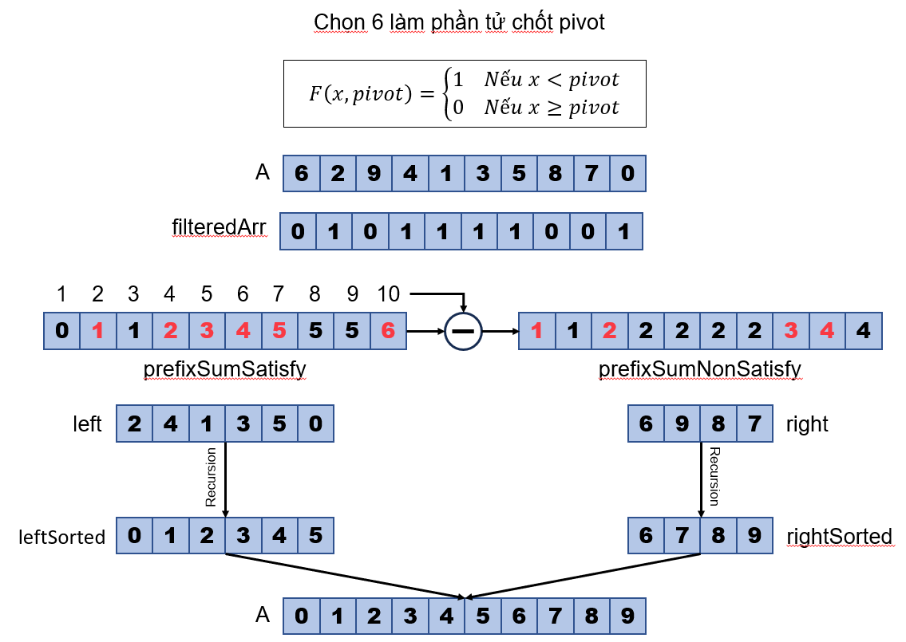

# GIẢI THUẬT PARALLEL QUICKSORT

**Ý tưởng chính**: để thực hiện sắp xếp nhanh trên đoạn $[L, R]$ của mảng $A$ một cách song song, ta chia đoạn thành hai phần dựa trên phần tử chốt $pivot$. Nửa con bên trái sẽ là tập hợp các phần tử nhỏ hơn pivot và ngược lại với nửa con bên phải sẽ là các phần tử lớn hơn pivot. Phân phối thực hiện đệ quy hai nhánh con trên các processor khác nhau. Để phân chia đoạn con một cách hiệu quả, ta áp dụng thuật toán Parallel Filtering với hàm điều kiện $F$:

$$
\begin{aligned}
    F(x, pivot) = 
    \begin{cases}
        1, & \text{Nếu } x \lt pivot \\
        0, & \text{Nếu } x \ge pivot \\
    \end{cases}
\end{aligned}
$$

**Mã giả**:
```actionscript
function Partition(A, pivot):
    filteredArr = parrallelFiltering(A, F(A, pivot))
    prefixSumSatisfy = parallelPrefixSum(filteredArr)
    
    in parallel:
        for i = 1 to length(prefixSumSatisfy):
            prefixSumNonSatisfy[i] = i - prefixSumSatisfy[i]

    left = packing(prefixSumNonSatisfy)
    right = packing(prefixSumSatisfy)

    return left, right


function Quicksort(A):
    if len(A) == 1:
        return A[1]

    pivot = A[1]
    left, right = Partition(A, pivot)

    leftSorted = fork quicksort(left)
    rightSorted = fork quicksort(right)

    join leftSorted and rightSorted

    return concatenate(leftSorted, rightSorted)
```

**Độ phức tạp**:

$$
\begin{aligned}
    Work&: O(nlogn) \\
    Depth&: O(log^2n)
\end{aligned}
$$


**Giải thích**: hàm `quicksort(A)` có tính năng thực hiện sắp xếp nhanh mảng $A$. Xét điều kiện cơ sở, ta sẽ trả về giá trị $A[1]$ nếu mảng chỉ chứa 1 phần tử. Tiến hành phân chia mảng A thành hai phần dựa trên `pivot=A[1]` là $left$ và $right$ sử dụng hàm `Partition(A, pivot)`. Tiếp theo, ta gọi đệ quy hàm `Quicksort` tương ứng trên hai nhánh con và tổng hợp nối ghép kết quả khi tất cả các tác vụ đã hoàn thành. Về hàm `Partition(A, pivot)`, thuật toán song song Filtering được sử dụng với hàm $F$ được mô tả ở trên nhằm khởi tạo mảng lọc gồm hai giá trị 0 1 tương ứng với thoã mãn điều kiện và không thoã mãn điều kiện. Sau đó, mảng tổng tiền tố các giá trị thoã mãn điều kiện $prefixSumSatisfy$ được tính toán dựa trên hàm song song PrefixSum với đầu vào là mảng lọc được tạo ra trước đó. Nhằm tối ưu hoá hiệu năng, ta có thể tính toán mảng tổng tiền tố các giá trị không thoã mãn điều kiện bằng cách duyệt song song qua mảng $prefixSumSatisfy$ và lấy chỉ số trừ đi cho giá trị tương ứng. Cuối cùng, các phần tử được chọn ra thông qua hàm `packing` với đầu vào là các mảng tổng tiền tố P bằng cách xét các giá trị của mảng $A$ tại vị trí $i$ sao cho $P[i] \ne P[i-1]$ 

**Ví dụ minh hoạ**:
