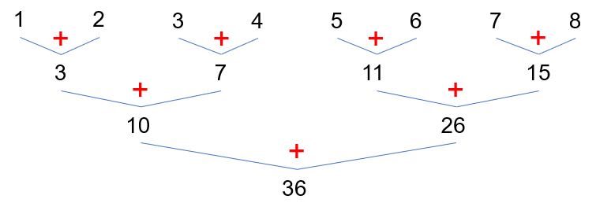

# GIẢI THUẬT PARALLEL SUM

**Ý tưởng chính**: để tính tổng của mảng trong đoạn $[L, R]$ một cách song song, ta chia đoạn thành hai phần nhỏ hơn và phân phối tính tổng của mỗi phần trên các processor khác nhau. Kết quả tổng hợp của bài toán là tổng của hai phần con.

**Mã giả**:
```actionscript
function Sum(A, L, R):
    if not (1 <= L <= R <= length(A)):
        return null

    if L == R:
        return A[L]

    mid = (L + R) / 2

    leftSum = fork Sum(A, L, mid)
    rightSum = fork Sum(A, mid + 1, R)

    join leftSum and rightSum

    sumLR = leftSum + rightSum
    return sumLR
```

**Giải thích**: hàm `Sum(A, L, R)` sẽ tính tổng của các phần tử của mảng $A$ trong đoạn $[L, R]$. Ta kiểm tra điều kiện của $L$ và $R$ ($1 \leq L \leq R \leq |A|$), hàm sẽ trả về giá trị của phần tử tại chỉ số $L$ nếu thoã mãn $L = R$ và $null$ trong các trường hợp còn lại. Tiến hành chia đoạn thành hai nửa bằng chỉ số `mid = (L + R) / 2`, sau đó gọi đệ quy `leftSum = Sum(A, L, mid)` và `rightSum = Sum(A, mid + 1, R)` để tính tổng của nửa trái và nửa phải một cách song song. Kết quả tổng hợp sẽ được trả về khi hai tác vụ trên hoàn thành với `sumLR = leftSum + rightSum`.

**Độ phức tạp**:
$$
Work: O(n) \\
Depth: O(logn) \\
$$


**Ví dụ minh hoạ**:
